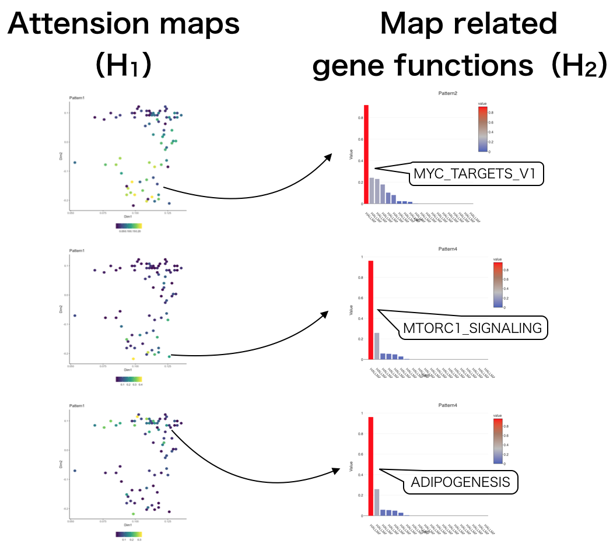

# Introduction
## About scTGIF

Here, we explain the concept of `r Biocpkg("scTGIF")`.
The analysis of single-cell RNA-Seq (scRNA-Seq) has a
potential difficult problem; which data corresponds to what kind of
cell type is not known _a priori_.

Therefore, at the start point of the data analysis of the scRNA-Seq dataset,
each cell is "not colored" (unannotated) (Figure 1).
There some approaches to support users to infer the cell types
such as (1) Known marker gene expression,
(2) BLAST-like gene expression comparison with reference DB,
(3) differentially expressed genes (DEGs)
and over-representative analysis (ORA)
([scRNA-tools](https://www.scrna-tools.org)).

The first approach might be the most popular method,
but this task is based on the expert knowledge about the cell types,
and not always general-purpose.
The second approach is easy and scalable,
but still limited when the cell type is not known
or still not measured by the other research organization.
The third approach can perhaps be used in any situation but ambiguous and
time-consuming task;
this task is based on the cluster label and the true cluster structure,
which is not known and some DEG methods have to be performed in each cluster,
but recent scRNA-Seq dataset has tens to hundreds of cell types.
Besides, a scRNA-Seq dataset can have low-quality cells and artifacts
(e.g. doublet) but it is hard to distinguish from real cell data.
Therefore, in actual data analytical situation, laborious
trial-and-error cycle along with the change of cellular label
cannot be evitable (Figure 1).

`r Biocpkg("scTGIF")` is developed to reduce this trial-and-error cycle;
This tool directly connects the unannotated cells and
related gene function.
Since this tool does not use reference DB, marker gene list,
and cluster label can be used in any situation without expert knowledge
and is not influenced by the change of cellular label.


In `r Biocpkg("scTGIF")`, three data is required; the gene expression matrix,
2D coordinates of the cells (e.g. t-SNE, UMAP), and geneset of MSigDB.
Firstly, the 2D coordinates are segmented as 50-by-50 grids,
and gene expression is summarized in each grid level (**X1**).
Next, the correspondence between genes and the related gene functions
are summarized as gene-by-function matrix (**X2**).
Here, we support only common genes are used in **X1** and **X2**.
Performing joint non-negative matrix factorization (jNMF) algorithm,
which is implemented in `r CRANpkg("nnTensor")`,
the shared latent variables (**W**) with the two matrices are estimated.


By this algorithm, a grid set and corresponding gene functions are paired.
Lower-dimension (**D**)-by-Grid matrix **H1** works as attention maps to help
users to pay attention the grids, and **D**-by-Function matrix **H2**
shows the gene function enriched in the grids.



`r Biocpkg("scTGIF")` also supports some QC metrics to distinguish
low-quality cells and artifacts from real cellular data.

# Usage
### Test data

To demonstrate the usage of `r Biocpkg("scTGIF")`,
we prepared a testdata of
[distal lung epithelium](https://www.nature.com/articles/nature13173).

```{r testdata, echo=TRUE, message=FALSE}
library("scTGIF")
library("SingleCellExperiment")
library("GSEABase")
library("msigdbr")

data("DistalLungEpithelium")
data("pca.DistalLungEpithelium")
data("label.DistalLungEpithelium")
```

Although this data is still annotated and the cell type label is provided,
`r Biocpkg("scTGIF")` does not rely on this information.

```{r testdata2, echo=TRUE, fig.width=7, fig.height=7}
par(ask=FALSE)
plot(pca.DistalLungEpithelium, col=label.DistalLungEpithelium, pch=16,
    main="Distal lung epithelium dataset", xlab="PCA1", ylab="PCA2", bty="n")
text(0.1, 0.05, "AT1", col="#FF7F00", cex=2)
text(0.07, -0.15, "AT2", col="#E41A1C", cex=2)
text(0.13, -0.04, "BP", col="#A65628", cex=2)
text(0.125, -0.15, "Clara", col="#377EB8", cex=2)
text(0.09, -0.2, "Cilliated", col="#4DAF4A", cex=2)
```

To combine with the gene expression and the related gene function,
we suppose the gene function data is summarized as the object of
`r Biocpkg("GSEABase")`.
This data is directly downloadable from MSigDB and can be imported like
gmt <- GSEABase::getGmt("/YOURPATH/h.all.v6.0.entrez.gmt")

Note that `r Biocpkg("scTGIF")` only supports NCBI Gene IDs (Entrez IDs)
for now.
When the scRNA-Seq is not about human, the situation is more complicated.
Here, we use `r CRANpkg("msigdbr")` package to retrieve
the mouse MSigDB genesets like below.

```{r gmt, echo=TRUE}
m_df = msigdbr(species = "Mus musculus",
    category = "H")[, c("gs_name", "entrez_gene")]

hallmark = unique(m_df$gs_name)
gsc <- lapply(hallmark, function(h){
    target = which(m_df$gs_name == h)
    geneIds = unique(as.character(m_df$entrez_gene[target]))
    GeneSet(setName=h, geneIds)
})
gmt = GeneSetCollection(gsc)
gmt = gmt[1:10] # Reduced for this demo
```

### Parameter setting : settingTGIF

Next, the data matrix is converted to the object of
`r Biocpkg("SingleCellExperiment")` package,
and the 2D coordinates are registered as the reducedDims slot.

```{r setting, echo=TRUE}
sce <- SingleCellExperiment(assays = list(counts = DistalLungEpithelium))
reducedDims(sce) <- SimpleList(PCA=pca.DistalLungEpithelium)
```

Although the default mode of `r Biocpkg("scTGIF")` use `count` slot as
the input matrix,
the normalized gene expression data can also be specified.
In such a case, we recommend using `normcounts` slot to register the data.

```{r setting2, echo=TRUE}
CPMED <- function(input){
    libsize <- colSums(input)
    median(libsize) * t(t(input) / libsize)
}
normcounts(sce) <- log10(CPMED(counts(sce)) + 1)
```

After the registration of the data in `sce`,
`settingTGIF` will work like below.

```{r setting3, echo=TRUE}
settingTGIF(sce, gmt, reducedDimNames="PCA", assayNames="normcounts")
```

### Calculate attention maps and map-related gene functions: calcTGIF

After the setting above,
`calcTGIF` calculates the jNMF with the two matrices described above.

```{r calc, echo=TRUE}
calcTGIF(sce, ndim=3)
```

### HTML Report : reportTGIF

Finally, `reportTGIF` generates the HTML report to summarize
the result of jNMF.

```{r, report, echo=TRUE}
reportTGIF(sce,
    html.open=FALSE,
    title="scTGIF Report for DistalLungEpithelium dataset",
    author="Koki Tsuyuzaki")
```

Since this function takes some time,
please type `example("reportTGIF")` by your own environment.

# Session information {.unnumbered}

```{r sessionInfo, echo=FALSE}
sessionInfo()
```